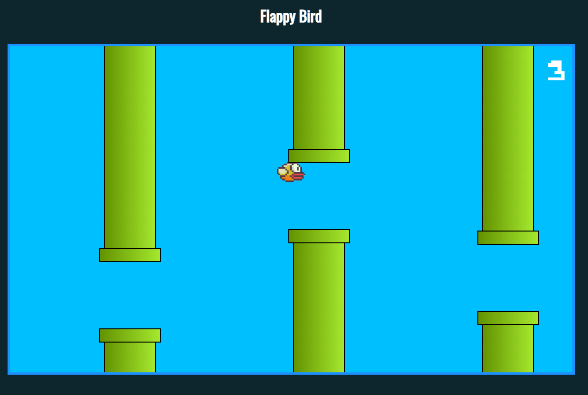

# 🐦 Flappy Bird - JavaScript

Jogo inspirado no clássico Flappy Bird desenvolvido com JavaScript puro, com foco em manipulação de DOM e lógica de programação.

## 🚀 Demonstração

## 🛠 Tecnologias
- HTML5
- CSS3
- JavaScript (Vanilla JS)

## 🎯 Conceitos Aplicados
- Manipulação de DOM
- Lógica de colisão
- Game Loop
- Controle de eventos
- Estruturação de funções

## 📸 Preview

## 📌 Objetivo
Projeto desenvolvido para consolidar fundamentos sólidos de desenvolvimento front-end sem uso de frameworks.